SeedClass
===============

**SeedClass** is an experimental implementation of a seed selection strategy that uses machine learning to enhance coverage-guided fuzz testing. It employs a binary classifier trained on input samples collected from past fuzzing campaigns to distinguish between *valid* inputs and malformed samples that trigger a program *crash*. The predictions of the trained model allows prioritizing inputs that exhibit characteristics similar to samples associated with known vulnerabilities, effectively guiding the fuzzer toward security-sensitive code paths.

## Training dataset

This repository contains a dataset used to evaluate the proposed seed selection strategy under realistic testing conditions. This case study focused on fuzzing the Windows graphics component using EMF files to assess the effectiveness of the strategy in identifying bugs.

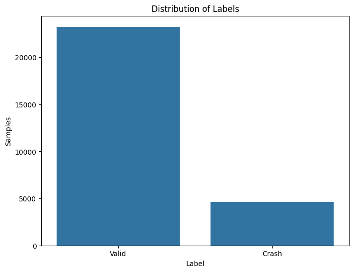
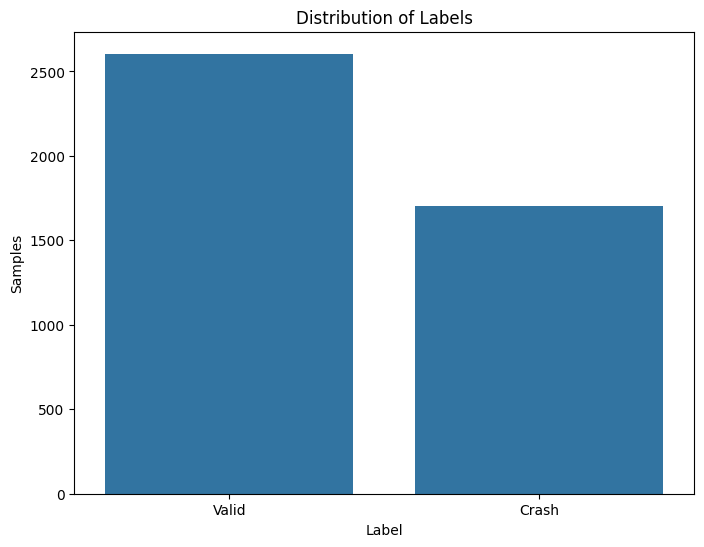

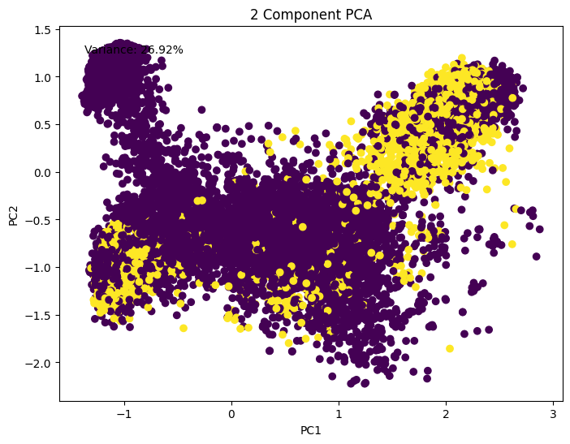
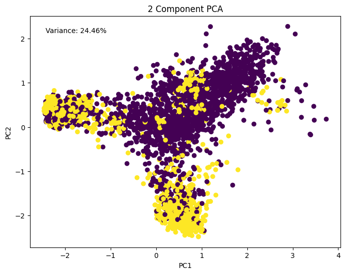

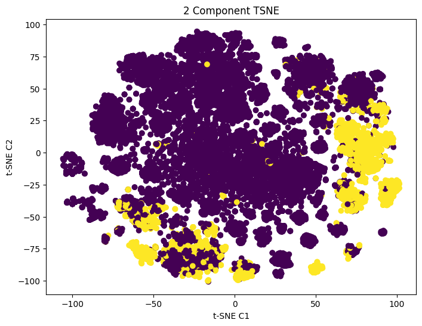
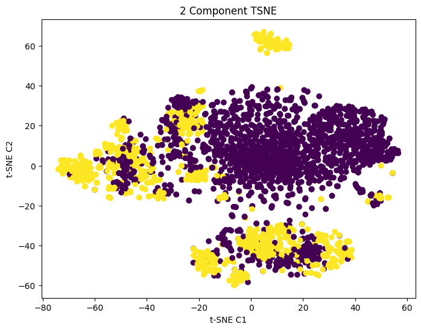

## Learning process

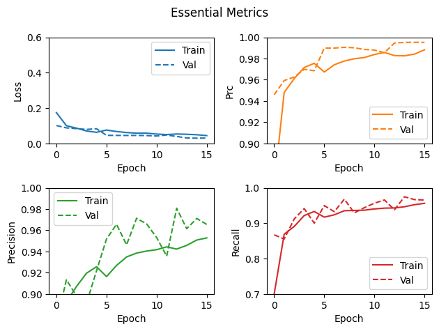
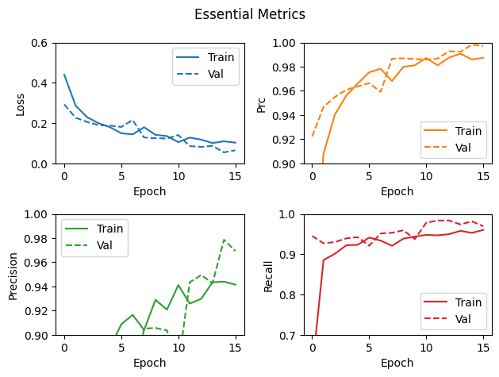

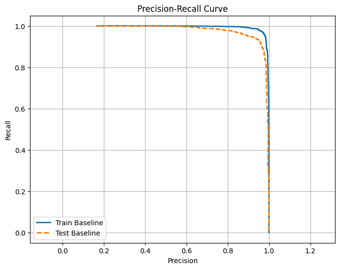
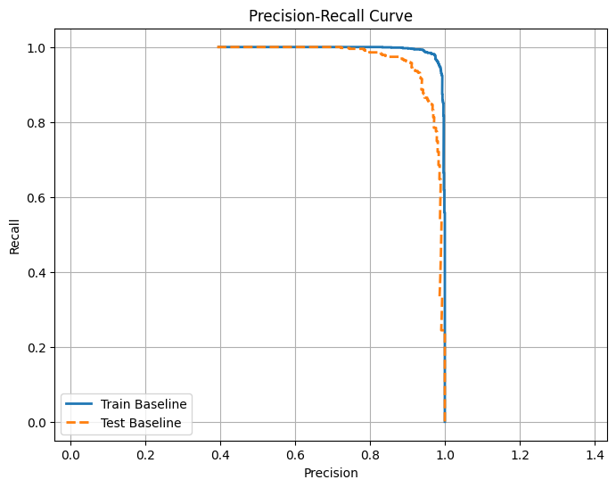

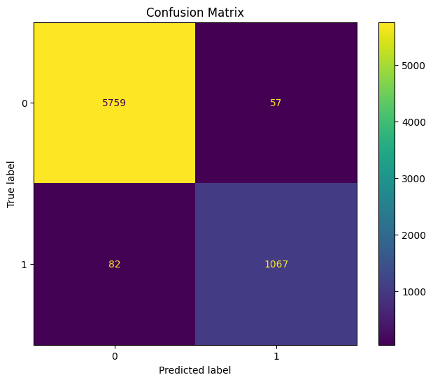

## Evaluation results

| Strategy             | Execs    | Speed    | Paths   | Pending  | Coverage   | Stability  | TTC       | Crashes |
|----------------------|----------|----------|---------|----------|------------|------------|-----------|---------|
| Randomize            | 182M     | 2.1k     | **19k** | 131k     | 38.81%     | 68.11%     | 01:17     | 46      |
| Minimize             | **252M** | **2.9k** | 18k     | 117k     | 39.11%     | 65.48%     | 01:11     | 59      |
| Predict (balanced)   | 212M     | 2.5k     | 17k     | 118k     | 39.04%     | 64.66%     | **00:11** | **108** |
| Predict (imbalanced) | 188M     | 2.2k     | 16.2k   | 109k     | 38.51%     | **70.17%** | 00:54     | 73      |
| Combine              | 154M     | 1.8k     | 17k     | **137k** | **40.37%** | 69.47%     | 04:27     | 62      |

## Distribution of bugs

| BugId      | Randomize | Minimize | Predict (balanced) | Predict (imbalanced) | Combine     |
|------------|-----------|----------|--------------------|----------------------|-------------|
| `0e5.7fb`  | 11        | 16       | 16                 | 4                    | 3           |
| `2b1.cf1`  |           |          |                    |                      | 1           |
| `3ce.9b5`  | 35        | 10       | 17                 | 10                   | 13          |
| `520.506`  | 1         | 7        |                    |                      |             |
| `5ab.a57`  |           |          |                    |                      | 5           |
| `6e7.9de`  |           |          |                    | 1                    |             |
| `8ed.260`  |           |          | 1261               | 847                  | 806         |
| `8ed.13f`  |           |          | 3                  | 4                    | 2           |
| `999.7fb`  | 1         |          |                    |                      |             |
| `be9.1bc`  |           |          | 1                  |                      |             |
| `d05.7fb`  |           | 6        | 76                 | 2                    |             |
| `db3.f44`  | 28        | 1        | 1                  |                      |             |
| `eb3.7fb`  | 11        | 23       | 34                 | 32                   | 16          |
| `efe.7fb`  | 3         | 9        | 11                 | 1                    | 2           |
| `f33.8ed`  |           |          | 2603               | 2464                 | 1726        |
| `f33.cf7`  |           |          | 158                | 104                  | 70          |

## Unique crash samples

| **File (SHA256)**     | **Size** | **BugId** | **Library**       | **Function**                               |
|-----------------------|----------|-----------|-------------------|--------------------------------------------|
| `00AE644CE5C9`        | 608      | f33.cf7   | GdiPlus.dll       | `DpRegion::Set`                            |
| `011E5AC5E789`        | 220      | 2b1.cf1   | Gdi32Full.dll     | `CreateFontIndirectWImpl`                  |
| `0330DE6EF25F`        | 806      | 358.586   | GdiPlus.dll       | `MRRESIZEPALETTE::bPlay`                   |
| `05B0FED97564`        | 608      | db3.f44   | GdiPlus.dll       | `Div64_Asm`                                |
| `097C40E7A079`        | 550      | e5f.b0d   | GdiPlus.dll       | `EmfEnumState::ModifyRecordColor`          |
| `09A8E14E95E9`        | 248      | 9ce.d2f   | GDI32.dll         | `CreateDIBitmap`                           |
| `0CC3CBE5B224`        | 446      | 3f4.c6a   | GdiPlus.dll       | `GdipGetWinMetaFileBitsEx`                 |
| `1455438460E2`        | 144      | d05.7fb   | GdiPlus.dll       | `EmfEnumState::CreatePen`                  |
| `19917F1A9771`        | 248      | 6b3.d8d   | Gdi32Full.dll     | `StretchDIBitsImpl`                        |
| `1FC0FB7EFAE0`        | 136      | 0e5.7fb   | GdiPlus.dll       | `EmfEnumState::ExtCreatePen`               |
| `21013B2BF3D4`        | 756      | 5ab.a57   | GdiPlus.dll       | `CopyGindices`                             |
| `2544E3E4EE24`        | 56020    | a89.bf8   | GDI32.dll         | `ConvertDxArray`                           |
| `29DE93CD3EFD`        | 526      | fe8.b17   | GdiPlus.dll       | `MfEnumState::ModifyDib`                   |
| `2D3E1B99717E`        | 159000   | c31.d2f   | GdiPlus.dll       | `DoRotatedStretchBlt`                      |
| `431E261EEC30`        | 612      | 9e2.372   | GdiPlus.dll       | `FullTextImager::Render`                   |
| `46F782B08565`        | 904      | 552.f99   | GdiPlus.dll       | `DoExtTextOut`                             |
| `4979D4379004`        | 236      | bba.7fb   | GdiPlus.dll       | `EmfEnumState::ModifyRecordColor`          |
| `51D49EC5E723`        | 313      | 289.e06   | GDI32.dll         | `pbmiConvertInfo`                          |
| `522AD0595FDE`        | 780      | cbf.7fb   | GdiPlus.dll       | `EmfEnumState::CreateDibPatternBrushPt`    |
| `54FF54F83BDB`        | 280      | 1ce.77d   | GdiPlus.dll       | `DrawImagePointsEPR::Play`                 |
| `5BA20DD2301B`        | 472      | 9f7.7fb   | GdiPlus.dll       | `EmfEnumState::SelectObject`               |
| `64F96E2C43A4`        | 232      | 999.7fb   | GdiPlus.dll       | `EmfEnumState::SetROP2`                    |
| `671F4A6C7173`        | 248      | 7c8.7c8   | msvcrt.dll        | `_VEC_memcpy`                              |
| `6E39F2B013BE`        | 3700     | 3a8.13d   | GdiPlus.dll       | `DoGdiCommentMultiFormats`                 |
| `77526891CE54`        | 555      | f33.8ed   | GdiPlus.dll       | `DpRegion::Set`                            |
| `79E5F5357EDA`        | 1270     | 334.995   | GdiPlus.dll       | `ToCOLORREF`                               |
| `8437F6E0B646`        | 248      | 72d.895   | GDI32.dll         | `MRSETDIBITSTODEVICE::bPlay`               |
| `878209CA7A27`        | 555      | 3ce.9b5   | GdiPlus.dll       | `GpStringFormat::SetData`                  |
| `893201F60329`        | 204      | 3cd.699   | GdiPlus.dll       | `bHandleFrameRgn`                          |
| `8A18FBD266E6`        | 248      | 72d.895   | GdiPlus.dll       | `bEmitWin16StretchBlt`                     |
| `8DDB06D2AA0E`        | 314      | 2b1.699   | GdiPlus.dll       | `bHandlePaintRgn`                          |
| `99161BA9CBC0`        | 769      | 6fe.4dc   | GdiPlus.dll       | `EpAliasedFiller::FillEdgesAlternate`      |
| `9F8741698275`        | 500      | 8bb.46b   | GdiPlus.dll       | `DoSetDIBitsToDevice`                      |
| `E00B5FAFBD7E`        | 578      | 8ed.260   | GdiPlus.dll       | `DpRegion::And`                            |
| `E112D9DC0123`        | 137      | efe.7fb   | GdiPlus.dll       | `EmfEnumState::ExtCreateFontIndirect`      |
| `F30797A5B8BB`        | 626      | 932.8d1   | GdiPlus.dll       | `ValidateBitmapInfo`                       |
| `F5F958FEF5E9`        | 599      | 853.699   | GdiPlus.dll       | `bHandleFillRgn`                           |
| `F7AFF247E121`        | 252      | 699.0e9   | GdiPlus.dll       | `bParseWin32Metafile`                      |
| `FD0F262AA4D7`        | 854      | -         | Gdi32Full.dll     | `MRBDIB::vInit`                            |
| `A390F3B1FEDF`        | 400      | 520.506   | Gdi32Full.dll     | `NamedEscape`                              |
| `44168A76232A`        | 608      | 2df.af7   | dwrite.dll        | `GlyphDataElement<...>::GetExistingGlyphs` |
